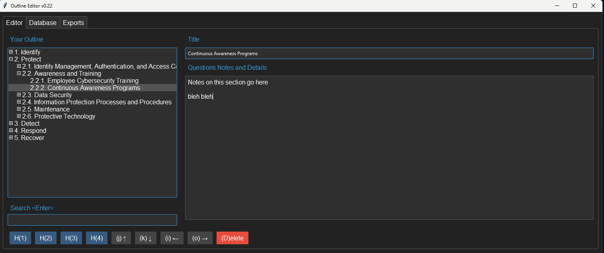

# Encrypted Outliner Notebook

I wanted something to create collapsible treeviews and take notes on each section.  

## Main Features

- Encrypted, Easily Organizable Notes
- Export perfect DOCX, PDF formatted document skeleton or complete works
- Import/Export JSON formatted Outline
- Clone entire sections, move into any section, all children at once.
- Swap/Export Databases/sections for data segregration
- Move sections easily to organize your thoughts/data
- Searchable
- Error checking everywhere possible
- No External calls/Telemetry

## Use Cases

- Complicated SOP you build over time like a firewall upgrade
- Book - novel, stories
- Recipes, Notes, etc
- NIST/CIS/CSF Policy checklist/notes
- Any type of Complicated Documents that needs structured data/sections
- Encrypted Journal
- Encrypted Private Local OneNote Replacment

## Todo

- Auto select fields/tab order various locations
- Export sections as markdown
- Refactor spaghetti AI helped cook
- Create More sample databases/json others might use
- ssh/email/copy/transfer/merge db to peers
- Built In Spellchecker
- Import CSV such as password keeper utility
- Config tab to edit changes by gui
- Add HMAC integrity
- Prompt Maker to get AI prompt for making outlines

## Installation

### Windows
1. Install Python 3.10 or higher.
2. Clone the repository or unzip the files into `C:\outliner`.
3. Open a terminal and navigate to `C:\outliner`.
4. Create a virtual environment: `python -m venv outliner`.
5. Activate the virtual environment: `outliner\Scripts\activate`.
6. Install dependencies: `python -m pip install -r requirements.txt`.
7. Edit `config.py` to customize font, colors, and other settings.
8. Run the application using `start.bat` or a shortcut to it.

### Linux
1. Install Python 3.10 or higher.
2. Clone the repository or unzip the files into `/home/username/outliner`.
3. Open a terminal and navigate to `/home/username/outliner`.
4. Create a virtual environment: `python3 -m venv outliner`.
5. Activate the virtual environment: `source outliner/bin/activate`.
6. Install dependencies: `pip install -r requirements.txt`.
7. Edit `config.py` to customize font, colors, and other settings.
8. Set execute permissions `chmod +x outliner.py`
9. Run the application: `./outliner.py`.

Password for default db is 1234

